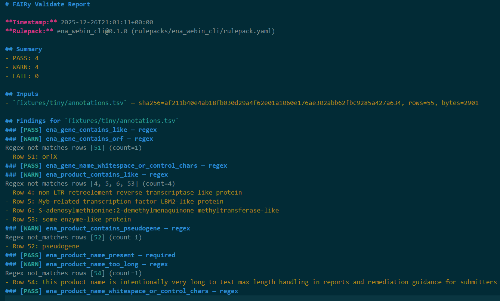

# FAIRy ENA Rulepacks (Community)

This repository contains **ENA-focused rulepacks** for **FAIRy** — a local-first validator/packager that runs rulepacks against tabular metadata and produces human-readable + machine-readable reports.

**Scope of this repo (community):**
- Reusable, ENA/Webin-style checks that apply broadly to common ENA submission metadata patterns.
- Small public fixtures and examples for demos/tests.

## Example output


_Example WARN findings from the ENA/Webin-style starter checks._
---

## What’s inside
> Note: the committed tiny fixture is provided as **both TSV and CSV** (`fixtures/tiny/annotations.tsv` and `fixtures/tiny/annotations.csv`). **TSV is canonical**; CSV is a delimiter-equivalent copy to ensure FAIRy works with either.

- `rulepacks/`
  - `ena_webin_cli/` — starter ENA community rulepack (Webin-style naming/annotation hygiene checks)
- `fixtures/`
  - `tiny/annotations.tsv` — committed tiny fixture used for demos/tests (tab-delimited)
  - `tiny/annotations.csv` — CSV equivalent of the tiny fixture (delimiter-equivalent copy)
  - `PROVENANCE.md` — where fixtures came from and how they were derived
- `scripts/`
  - `extract_embl_products.py` — helper to extract CDS `/product` (and gene/locus when present) from EMBL flatfiles into TSV
- `tests/`
  - `golden/expected_report.tsv.json` — snapshot output for TSV fixture
  - `golden/expected_report.csv.json` — snapshot output for CSV fixture
---

## Prerequisites

You need **FAIRy** installed from `fairy-core`.

**FAIRycore requirement:** TSV inputs require `fairy-core v0.2.2+` (CSV works on earlier versions).

Example (from a Python venv):

```bash
pip install -e /path/to/fairy-core

```
---
## Quickstart (dev workflow)
### Generate/refresh fixtures from ENA EMBL flatfiles

1. Download one or more ENA records as EMBL flatfile (public INSDC/ENA accessions).
2. Put them under:

```bash
fixtures/raw_downloads/ena_embl
```
3. Run extraction:
```bash
python scripts/extract_embl_products.py
```
This writes:
`fixtures/tiny/annotations_all.tsv` (derived pool)
Then curate/update:
`fixtures/tiny/annotations.tsv` (committed tiny fixture)

(Optional) regenerate `fixtures/tiny/annotations.csv` from the TSV for compatibility testing.
See `fixtures/PROVENANCE.md` for sourcing and notes.
---

## Running FAIRy with ENA rulepack

Run FAIRy against a fixture file with the ENA rulepack:

```bash
mkdir -p out

fairy validate \
  --inputs default=fixtures/tiny/annotations.tsv \
  --rulepack rulepacks/ena_webin_cli/rulepack.yaml \
  --report-md out/ena_validate.md \
  --report-json out/ena_validate.json

```
You can also pass `fixtures/tiny/annotations.csv`.

Outputs typically include:
- `out/ena_validate.md` (human-readable)
- `out/ena_validate.json` (machine-readable)

## Tests (goldens)

Run snapshot tests (requires FAIRy installed):

```bash
FAIRY_BIN=fairy scripts/run_golden.sh
```
To refresh expected outputs after intentional change:
```bash
UPDATE_GOLDEN=1 FAIRY_BIN=fairy scripts/run_golden.sh
```
---
## Contributing
Issues and PRs welcome:
- new ENA/Webin-inspired checks
- better fixtures (public-source and documented provenance)
- improved remediation wording for novices
---
## License
See `LICENSE`.